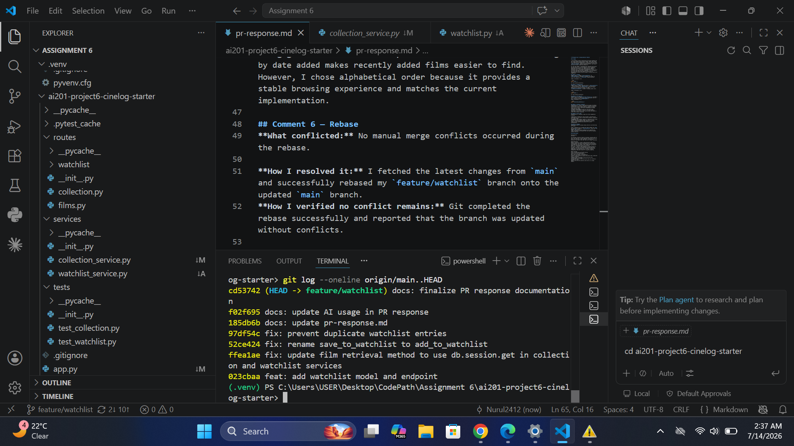

# PR Response Doc — CineLog Watchlist Feature

## AI Usage

I used ChatGPT to help me understand the existing codebase and the review comments before making changes. Rather than asking AI to generate the implementation, I used it to identify which files were relevant, explain the existing patterns (such as how `add_to_collection()` handled duplicate entries), and clarify what each reviewer comment was asking for.

For the code changes, I implemented the requested fixes myself and then used AI to verify my approach. AI also helped me understand the purpose of the rebase workflow, suggested an appropriate test structure by referencing the existing collection tests, and reviewed my documentation to make sure it accurately described the work I completed. I ran the project's test suite after each code change to verify that the implementation worked correctly instead of relying solely on AI suggestions.

## Comment 1 — Rename
**What I did:** I renamed `save_to_watchlist()` to `add_to_watchlist()` everywhere throughout the project to follow the repository's `verb_to_noun` naming convention.

**How I verified:** I ran:

```bash
pytest tests/ -v 
```
All tests passed successfully.

## Comment 2 — Deduplication
**What I did:** I added a duplicate check to `add_to_watchlist()`. Before creating a new `WatchlistEntry`, the function now checks whether the user already has the same film in their watchlist. If a duplicate is found, it raises `AlreadyInCollectionError` instead of creating another entry.

**How I verified:** I ran:

```bash
pytest tests/ -v
```
All tests passed successfully.

## Comment 3 — Missing test
**What I did:** I created `tests/test_watchlist.py` and added a test to verify that attempting to add a nonexistent film to a user's watchlist raises `FilmNotFoundError`.
**How I verified:** I ran:

```bash
pytest tests/test_watchlist.py -v
```

## Comment 4 — Default visibility
**My position:** I chose to keep watchlists public by default.
**Reasoning:** The watchlist feature is intended to encourage sharing and discovery. Making watchlists public by default allows users to easily share movie recommendations without requiring extra setup.
**Tradeoff acknowledged:** Some users may prefer their watchlists to be private by default. If privacy becomes a requirement in the future, users could be given the option to choose their default visibility.

## Comment 5 — Sort order
**My position:** I decided to keep the current alphabetical ordering.

**Reasoning:** Alphabetical order provides a consistent and predictable way for users to browse their watchlist, especially as it grows larger.
**Engagement with reviewer's point:** I understand that sorting by date added makes recently added films easier to find. However, I chose alphabetical order because it provides a stable browsing experience and matches the current implementation.

## Comment 6 — Rebase
**What conflicted:** No manual merge conflicts occurred during the rebase.

**How I resolved it:** I fetched the latest changes from `main` and successfully rebased my `feature/watchlist` branch onto the updated `main` branch.
**How I verified no conflict remains:** Git completed the rebase successfully and reported that the branch was updated without conflicts.



## PR Description

PR Description
Overview:

This PR adds a watchlist feature to CineLog, allowing users to save films they want to watch separately from their collection. Users can add films to their watchlist, retrieve their watchlist, and remove films when they are no longer interested.

Design Decisions:
Default visibility: I chose to keep watchlists public by default because the feature encourages users to share movie recommendations and discover films through others' watchlists. While some users may prefer private watchlists, that can be added as a configurable option in the future.
Sort order: I chose to keep alphabetical ordering because it provides a consistent and predictable browsing experience, especially for larger watchlists. Although sorting by date added makes recent additions easier to find, I believe alphabetical ordering is better for long-term usability.

Manual Testing:
Start the application with python app.py.
Create or use an existing user.
Add a film to the user's watchlist.
Verify the film appears in the watchlist.
Attempt to add the same film again and confirm that a duplicate entry is prevented.
Attempt to add a nonexistent film_id and verify that FilmNotFoundError is raised.
Retrieve the watchlist and verify that films are returned in alphabetical order.
Remove a film from the watchlist and verify it no longer appears.